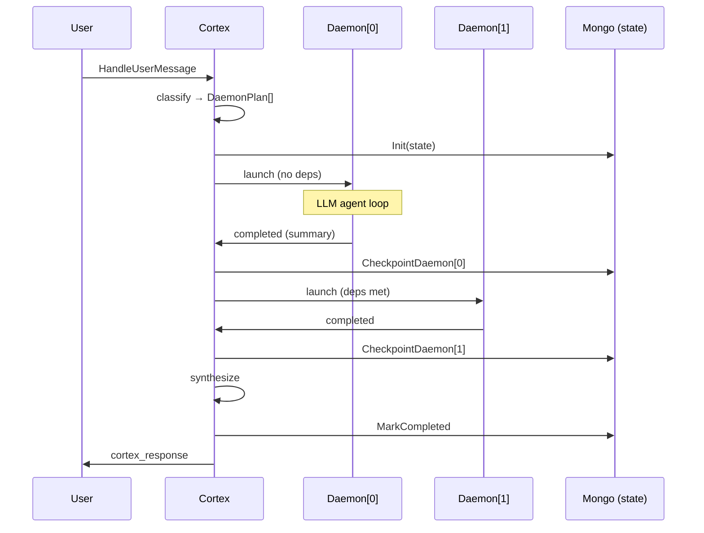
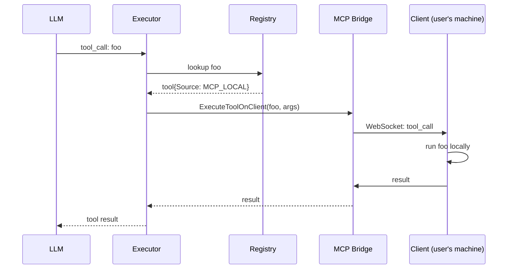

# DobbyAI — Systems Reference

This document covers the **agentic + automation** subsystems that distinguish DobbyAI from a generic chat UI: Nexus multi-agent, the durable workflow engine, the embedding-based memory system, the tool registry + MCP routing layer, and the OTel-backed observability story.

For repo layout, build/run instructions, and the broader chat/auth/admin systems, see [ARCHITECTURE.md](ARCHITECTURE.md) and [DEVELOPER_GUIDE.md](DEVELOPER_GUIDE.md).

The level of detail here is "engineer who needs to extend or debug this subsystem" — every claim is backed by a file:line citation so you can jump into the code.

---

## 1. Nexus — Multi-Agent Orchestration

Nexus turns one user message into a DAG of specialized daemons that run in parallel where they can, sequentially where they must, and hand off structured artifacts to each other. The flow:

```
user message
  → Cortex classifier (LLM)
  → DaemonPlan[] DAG (with depends_on)
  → DaemonRunner goroutines (parallel where possible)
  → synthesis (LLM)
  → response
```

### Entry point and dispatch

`internal/services/cortex_orchestrator.go:55` — `HandleUserMessage`. This is the door to the whole system; everything Nexus-related starts here.

The classifier (`classifyRequest`, `cortex_orchestrator.go:288`) decides one of four modes:
- `quick` — direct LLM response, no daemon
- `daemon` — single specialist daemon
- `multi_daemon` — DAG of specialists
- `status` — read-back of in-flight or recent work

Mode override is supported (`HandleUserMessage` accepts `modeOverride` and `templateID`) so the frontend can skip classification when the user explicitly picked a daemon template.

### DAG execution

`cortex_orchestrator.go:658` — `orchestrateMultiDaemon`. The execution loop:
1. Launch all daemons with `len(plan.DependsOn) == 0` (root nodes) up to the per-user concurrency cap (`maxDaemonsPerUser = 5`, `cortex_service.go:63`).
2. As daemons emit `update.Type == "completed"`, check pending daemons whose deps are now satisfied (`allDepsMet`, `cortex_orchestrator.go:1056`) and launch them.
3. A failed daemon cascade-fails its downstream chain (`failDependentChain`, `cortex_orchestrator.go:1007`) — protects against burning cycles on work that can't possibly use the failed predecessor's output.
4. When `running == 0 && len(pending) == 0`, run synthesis (`synthesizeResults`, `cortex_orchestrator.go:941`) and emit the final `task_completed` event.

### Per-daemon execution

`internal/services/daemon_runner.go:224` — `Execute`. Each daemon runs its own LLM agent loop:
- Max 25 iterations (`daemon_runner.go:327`), vs chat's 10 — daemons are autonomous, not interactive.
- Tool results are adaptively truncated based on context fill ratio (`adaptiveResultForLLM`, `daemon_runner.go:503`): 16K @ <40% fill, down to 2K @ >80%.
- Context overflow recovery is 3-tier (`callLLMWithOverflowRetry`, `daemon_runner.go:642`): normal → emergency trim (200 chars) → nuclear (system + summary + last 4 msgs).

### Dependency handoff: text vs structured

A dependent daemon gets two kinds of input from its predecessors:

**Text dep results** — `DepResults map[string]string`, capped at 4K chars per result, injected into the system prompt as "Previous Daemon Results" (`cortex_context_builder.go:135`). Fast and simple. Loses structure on long outputs.

**Structured artifacts** — Predecessors call `produce_artifact(name, content_type, content, summary)`. The artifact is stored in Mongo (`internal/services/nexus_artifact_store.go`), capped at 1 MiB per artifact, 30-day TTL. Successors see a slim catalogue in their system prompt (just `name + content_type + summary + size`, no body) and pull full content on demand via `read_artifact(name)`. This is the path you want when the output is structured (CSV, JSON, big markdown) or potentially big.

The three artifact tools are registered in `internal/tools/registry.go` like any other tool. The session/user binding is injected at tool-execution time via well-known args keys (`daemon_runner.go` `nexusArtifactToolAdapter`) — avoids a services→tools cycle.

### Durability + crash resume

`internal/services/nexus_orchestration_state.go` — per-orchestration Mongo doc keyed by `(session_id, parent_task_id)`. The contract:
- `Init` upserts the state at orchestration start. `$setOnInsert` for the immutable fields, `$set` for status + heartbeat — so calling Init again on resume preserves `completed_daemons`.
- A 10s heartbeat ticker keeps `last_heartbeat_at` fresh (`runOrchestrationHeartbeat`, `cortex_orchestrator.go:797`).
- Every completed daemon is checkpointed (`CheckpointDaemon`) before the orchestrator moves on.
- `MarkCompleted` at the end flips the status and stamps `completed_at`, which feeds a 14-day TTL index that prunes old docs.

On backend boot (`cmd/server/main.go` around the "NEXUS-RESUME" log line), a 3s-delayed orphan scan calls `FindOrphaned(90s)` and, for each result, spawns `ResumeOrchestration` (`cortex_orchestrator.go:823`). Resume:
- Reloads each daemon doc by ID from the pool.
- Pre-populates the `completed` map from the saved state.
- Re-enters `orchestrateMultiDaemon` with the resume map — daemons in that map are skipped; remaining ones with met deps launch immediately.
- Side-effects (engram writes, template stat updates, learning extraction) only fire for daemons that actually re-launch — so resume is idempotent.

**Known durability limitations:**
- Single-node assumption. Multi-node deployments would need a Mongo lease so two pods can't both resume the same orphan.
- A daemon crash *between* finishing its LLM work and the checkpoint write means a re-run on resume — fine for read-mostly daemons, worth knowing for daemons with external side-effects (sent emails, paid charges).



---

## 2. Workflow Engine — Durable Block DAG

The workflow engine runs user-defined block DAGs (LLM blocks, tool blocks, webhooks, conditionals, variables) with durability properties that match the Nexus pattern: per-block checkpoint, heartbeat, orphan-resume on boot.

### Entry points

`internal/execution/engine.go` — the main runner.
`internal/execution/agent_block_executor.go` — the LLM block executor.
`internal/execution/llm_executor.go` — provider-aware LLM call.

### Durability

`internal/execution/state_store.go` — `MongoStateStore`. One document per execution in `workflow_execution_state`:
- `Init(execution_id, workflow_id, user_id, snapshot, input)` — upsert preserving `block_outputs`.
- `CheckpointBlock(execution_id, block_id, ckpt)` — atomic per-block write using dot-notation `block_outputs.<id>` so concurrent block goroutines don't race.
- `GetBlockOutput(execution_id, block_id)` — the **idempotency cache**. The engine calls this before each block; a hit means the block already completed in this execution and the output is reused. This is what makes side-effecting blocks safe across crash + resume.
- `Heartbeat` every 10s, `FindOrphaned(90s)` on boot, `MarkCompleted` at end.

Block IDs containing `.` or `$` get sanitized (`sanitizeBSONKey`) — Mongo would otherwise treat them as path separators / operators and silently corrupt the nested document. The sanitizer is symmetric: writes + reads both route through it.

### Concurrency limit

`internal/execution/concurrency.go` — `WorkflowLimiter`. Per-workflow concurrency cap (default 5) to stop a misconfigured webhook trigger from self-DoS-ing the system. `Acquire` returns a `*LimiterError` when at cap; the webhook handler maps this to HTTP 429 + `Retry-After` (`internal/handlers/webhook_trigger.go`).

### Observability

`internal/execution/tracing.go` bootstraps OpenTelemetry with three exporters wired in parallel: stdout (dev), OTLP HTTP (for Tempo/Jaeger if the operator wants it), and a custom **Mongo span exporter** (`internal/execution/mongo_span_exporter.go`).

The Mongo exporter is what powers the **in-product trace viewer** at `/admin/traces` — no external Tempo install needed. Every executor (`agent_block_executor.go`, `llm_executor.go`, `block_checker.go`, `engine.go`) wraps work in an OTel span; spans land in Mongo, the admin endpoint (`internal/handlers/traces_admin.go`) returns them, the React page (`frontend/src/pages/admin/Traces.tsx`) renders a waterfall.

### Per-execution cost

`internal/execution/cost.go` rolls up token + dollar cost across all LLM blocks in an execution. Surfaces in the execution detail view.

---

## 3. Memory — Embedding-Backed + Agentic Tools

Memory has two related but separate jobs:

### Storage + decay

`internal/services/memory_extraction_service.go` — after each conversation turn, an LLM extraction pass pulls candidate memories (facts the user told us, preferences, ongoing goals) and stores them with an embedding.

`internal/services/memory_decay_service.go` — periodic job (every 6h) that recomputes a freshness score and archives memories that drop below threshold. Stops the corpus from growing without bound.

### Retrieval

`internal/services/memory_selection_service.go` — for each chat turn, embed the incoming message (Bedrock Titan v2 via `internal/services/embedding_service.go`), cosine-similarity rank against the user's active memories, return top-k. Drops per-turn memory cost from "all memories in system prompt" (~500ms + ~1-2k tokens) to "top-k by similarity" (~50ms + ~0 tokens for the unused ones).

### Agentic tools

`internal/tools/memory_tools.go` exposes two tools the model can call mid-conversation:
- `add_memory(content, tags?)` — write a new memory immediately, not waiting for the post-turn extraction.
- `search_memory(query, k?)` — explicit recall when the model knows it needs older context.

The user-facing UI is `frontend/src/components/settings/MemoryList.tsx` (Settings → Memory). Lets the user view, edit, and delete what the system has stored about them.

### Bedrock embeddings note

The Bedrock OpenAI-compatible shim does NOT expose `/openai/v1/embeddings`. The embedding service detects Titan model IDs and routes those calls through the native invoke endpoint (`/model/amazon.titan-embed-text-v2:0/invoke`) using the same Bearer ABSK token. See `embedding_service.go` for the URL switch.

---

## 4. Tools + MCP Routing

### The shared registry

`internal/tools/registry.go:46` — one global singleton holding two layers:
- **Built-in tools** — backend functions registered in `registerBuiltInTools`. ~80 tools: search, math, GitHub, Slack, MongoDB, image gen, the artifact tools, the memory tools, code execution via E2B.
- **MCP tools** — registered per-user when a Dobby's Claw client connects (`internal/services/mcp_bridge_service.go:113`). Marked `Source = MCP_LOCAL`.

Both layers serialize to OpenAI Chat Completions tool format via `Registry.List`. Chat and Daemon LLM calls share the same format.

### Tool selection asymmetry

| | Chat | Daemon |
|---|---|---|
| Max iterations | 10 | 25 |
| Skill-first filtering | yes (skill's `RequiredTools` only) | no (skills add tools, never restrict) |
| Tool count cap | none enforced | 100, MCP-prioritized |
| Result truncation | post-stream cleanup | adaptive per-call |
| Overflow recovery | basic | 3-tier |
| Cross-step handoff | none | dep results + artifact store |

**Chat tool selection** (`chat_service.go:1680-2000`): if a skill matched via `SkillService.RouteMessage`, only its `RequiredTools` + a small always-on set (`ask_user`, `search_web`, `describe_image`); else the `ToolPredictorService` narrows credential-filtered tools by LLM prediction or heuristic.

**Daemon tool selection** (`cortex_tool_selector.go:40`): all MCP tools always included (never filtered — they're the user's local tools); built-ins credential-filtered + predictor-narrowed; hard cap at 100 with MCP prioritized so user tools are never hidden.

### MCP routing

The user's MCP client (Dobby's Claw) WebSocket-connects to the backend and sends its tool catalog (`MCPBridgeService.RegisterClient`). When the LLM calls a tool, the executor checks `tool.Source`:
- `MCP_LOCAL` → `MCPBridge.ExecuteToolOnClient` sends the call over the WS to the user's machine, waits 30-60s for the result on a channel.
- otherwise → in-process via `registry.Execute`.

This is why MCP tools work without any backend-side credentials — they execute on the user's machine.



### Skill resolution (3-tier)

`cortex_orchestrator.go:180-213` — for each user message:
1. **Explicit** from frontend
2. **Pinned** to session (`session.PinnedSkillIDs`)
3. **Auto-routed** — `SkillService.RouteMessage` (`skill_service.go:354`) scores skills against the message: `TriggerPatterns` +20 prefix / +10 substring; `Keywords` +10 exact / +5 partial. Threshold 15.

Resolved skills attach two ways: `SystemPrompt` pasted into the daemon's system prompt under `## Active Skills`, and `RequiredTools` merged into `daemon.AssignedTools`.

---

## 5. The Bedrock OpenAI Shim

We hit Bedrock as if it were OpenAI — `bedrock-runtime.<region>.amazonaws.com/openai/v1/chat/completions`, Bearer ABSK key, standard tool-calling format. No SigV4, no proxy.

`internal/services/provider_service.go` auto-discovers Bedrock models via `/openai/v1/models` and stores them in MySQL. The admin UI lists discovered models with toggle visibility per tier.

Model identifier safety: the system used to pass composite `id:slug` strings to providers, which Bedrock rejected. The `GetByModelID` method was deleted entirely — all callers now use `GetByModelIDWithName` (returns the provider's actual model name) or `GetTextProviderWithModel`. Compiler-enforced contract; broken at compile time if a regression sneaks in.

Embeddings detour: `/openai/v1/embeddings` doesn't exist on Bedrock's shim. `embedding_service.go` routes Titan calls to the native invoke endpoint (see Memory section).

---

## 6. Where to start when extending the system

| Goal | Entry point |
|---|---|
| Add a new built-in tool | `internal/tools/registry.go` `registerBuiltInTools`, then write your tool implementation |
| Add a new daemon template | `internal/services/daemon_template_store.go` `getDefaultTemplates` |
| Add a new built-in skill | `internal/services/skill_seeds.go` `getBuiltinSkills` |
| Add a new workflow block type | `internal/execution/` add an executor; register in `engine.go` |
| Add a new LLM provider | `internal/services/llm_*_provider.go`; register in `provider_service.go` |
| Add a Nexus admin endpoint | `internal/handlers/nexus_handler.go` + register in `cmd/server/main.go` |
| Render new event in chat | Subscribe to `NexusEventBus`, handle in `frontend/src/components/nexus/` |

---

## 7. Integration test surface

Run with `go test -tags=integration -timeout 60s ./...` against a live Mongo (default `mongodb://localhost:27017`). Each test gets a throw-away database that's dropped on cleanup.

| Test file | Covers |
|---|---|
| `internal/services/nexus_orchestration_state_test.go` | Init upsert, checkpoint, heartbeat, orphan detection, MarkCompleted |
| `internal/services/nexus_artifact_store_test.go` | Produce/Read/List/DeleteForSession, upsert semantics, content cap, validation |
| `internal/execution/state_store_integration_test.go` | Workflow durability lifecycle, orphan detection, block ID sanitization, concurrency limiter |

Unit tests (no Mongo) run with plain `go test ./...`. Several pre-existing tests fail because the project migrated from SQLite to MySQL but their setup wasn't updated — unrelated to the new systems documented here.

---

## 8. Anti-goals (deliberately not in this system)

- **Multi-tenant cross-user agent communication.** Sessions and artifacts are user-scoped on purpose.
- **Daemon-to-daemon network calls.** All cross-daemon communication is via the artifact store or text dep results — keeps the resume model simple.
- **Backend-side persistent compute beyond the agent loop.** E2B sandboxes are per-chat (15-min idle eviction), not long-running services.
- **Forking workflows mid-execution.** A workflow execution is a DAG; if you need branching, the right model is multiple workflows triggered by the same event.
